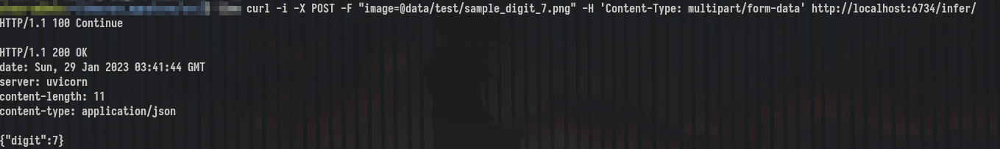

# MNIST Classifier training and deployment

This repository contains code for training an MNIST classifier (a feed-forward neural network with 1 hidden layer) as well as deploying the trained model using FastAPI in a docker container.

## Directory structure
- src/ : contains the source code for training, inference and deployment
- config/ : store the configuration yaml files related to training, inference and deployment
- data/ : training and test images are stored in this
  - test/ : contains test images, by default it has sample_digit_7.png which contains an image of digit 7 
- models/ : trained model is stored here and used for inferencing from here
- screenshots/ : contains the screenshots which are shown in README

## Training
Inside src/ there is a train.py script which is used to train an MNIST classifier, which is a neural network with one hidden layer. Some training parameters such as learning rate, number of epochs etc. can be varied using configs/training.yaml file. 
The train.py file automatically downloads the MNIST train and test data into data/raw directory. After training, the trained model is exported in an ONNX format to the models/ directory. 

## Inference
Inside src/ there is an inference.py script that is used to perform test inference on the model; without starting any sort of REST server. It uses the model trained in the training step and the image data/test/sample_digit_7.png. These configurations can be changed in configs/inference.yaml.

## Deployment
### Without docker
The trained model is hosted via a REST endpoint using FastAPI and model inference is done using onnxruntime. Currently, I have done CPU inference which should be enough for us.

Go to the src/ directory and run the following command in the terminal-
```
uvicorn server:app --host 0.0.0.0 --port 6734 &
```
Now a uvicorn server is started at port 6734. Run the following command to do the inference through it.
```
curl -i -X POST -F "image=@../data/test/sample_digit_7.png" -H 'Content-Type: multipart/form-data' http://localhost:6734/infer/
```

### With docker
First, ensure that the model mnist_classifier.onnx is in the models/ directory. My trained model can be downloaded from [google drive](https://drive.google.com/file/d/1WHDNarse0Sgq0gc9oEx0p3VHXVr71en_/view).

Then, use the Dockerfile to build the docker image with name mnist_classifier-
```
docker build -t mnist_classifier:v1 .
```

The onnx model gets embedded into the docker image.

Now, use the docker image to spawn a container-
```
docker run -d --name MNISTclassifier -p 6734:6734 mnist_classifier:v1
```

This starts the server on port 6734 and POST endpoint infer/. We can now hit the server with a curl request.
```
curl -i -X POST -F "image=@data/test/sample_digit_7.png" -H 'Content-Type: multipart/form-data' http://localhost:6734/infer/
```

Received response- 



Data flow-


